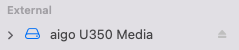
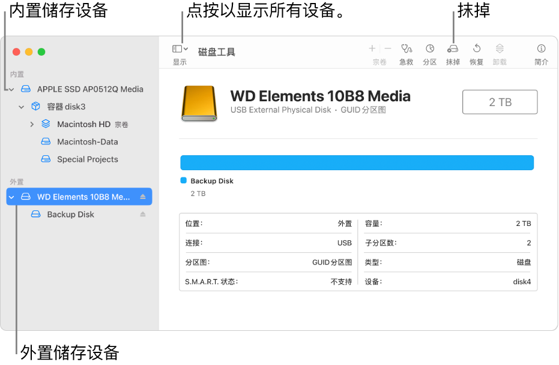
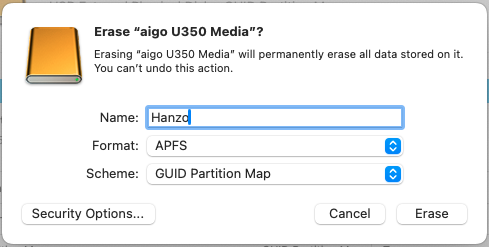
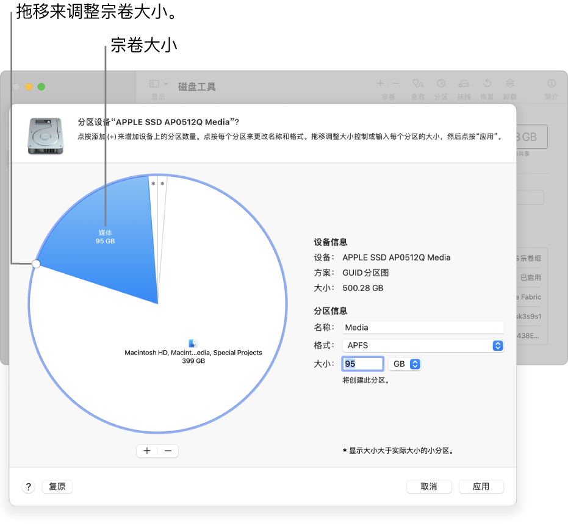
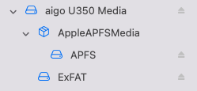

# MacOS中将硬盘同时分区APFS和ExFAT

> 我们常用的NTFS文件系统为Windows默认，在MacOS中可读但不可写。而MacOS常用的APFS在Windows中无法使用。当然可以利用第三方应用实现跨系统的文件访问。我个人基本使用MacOS进行剪辑，Windows可以进行少量文件转存即可。因此我将硬盘同时分区APFS和ExFAT。
>
> 不直接使用ExFAT是因为MacOS的文件系统有一个很大的优势

### **1. 打开“磁盘工具”**

`⌘` + `␣`打开搜索，输入**磁盘工具**并打开应用。

插入硬盘/U盘后可以在左边发现，点击需要格式化的设备。

### **2. 抹掉硬盘**

在边栏中选择想要抹掉的储存设备，然后点按**抹掉**按钮  。

* **名称**：自行填写。

* **方案**：GUID 分区图。

* **格式**：APFS（区分大小写自行选择，都可以）。

需先选择**方案**，才能选择**格式**。点按**抹掉**，然后点按**完成**。

**我们已经成功将硬盘/U盘抹掉成MacOS的APFS格式**

### **3. 分区并格式化为ExFAT**

点按工具栏中的“分区”按钮 。

点按饼图下方的添加按钮 ，然后点按**添加分区**。

*【注】*如果点按的是“添加宗卷”，你可以点按添加按钮以在容器中创建额外的 APFS 宗卷，或者点按“取消”以返回“磁盘工具”窗口而不对储存设备进行任何更改。

* **名称**：自定义宗卷的名称。（对于 MS-DOS (FAT) 和 ExFAT 宗卷，宗卷名称的最大长度为 11 个字符。）

* **格式**：选取**ExFAT**。

* **大小**：输入或拖移调整大小。

点按**应用**，然后点按**分区**。

### **4. 完成分区**

成功分区后大致入下图所示。**APFS**仅在**MacOS**中使用，**ExFAT**在**MacOS**和**Windows**中均可使用。

