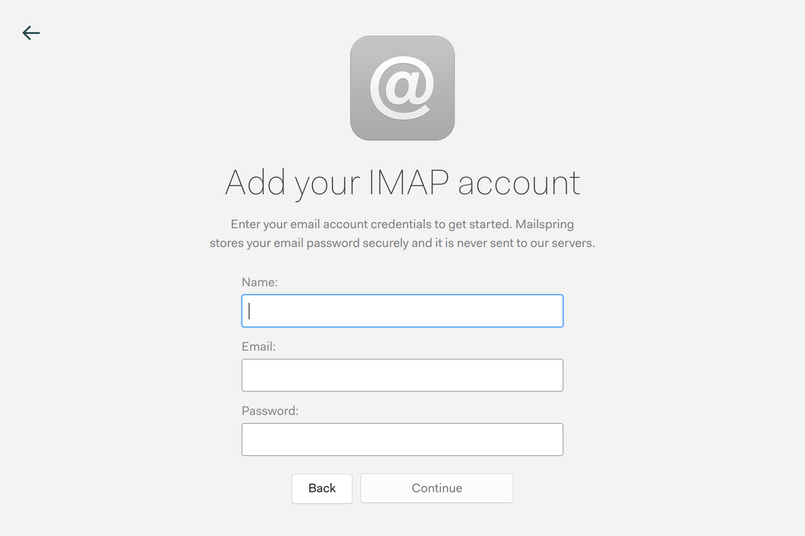
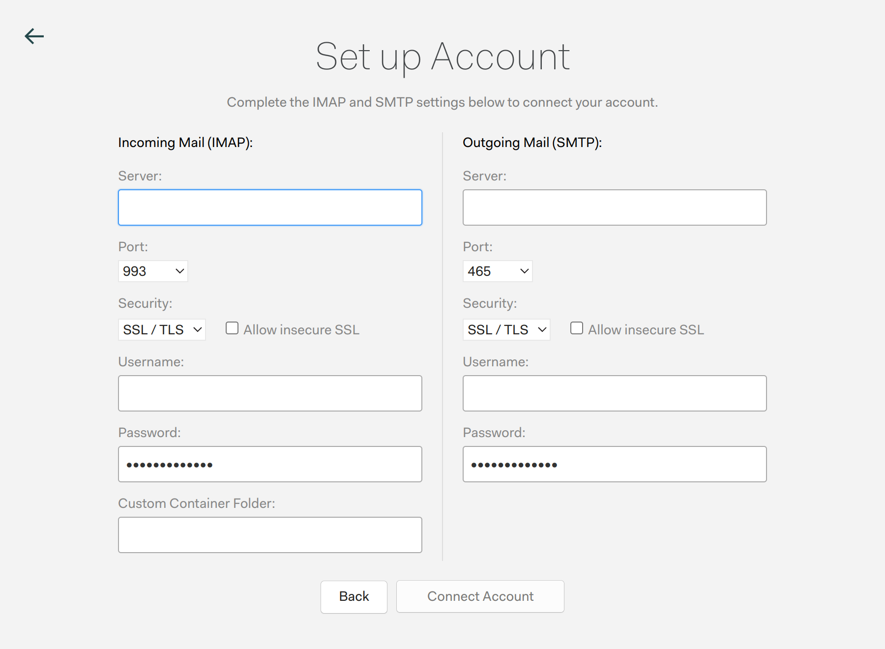
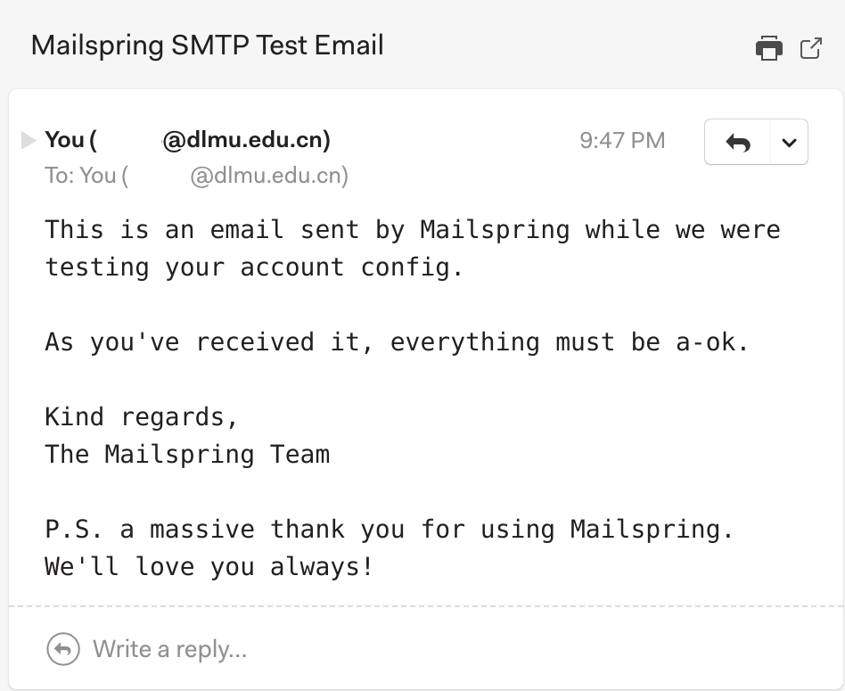

> 大连海事大学邮件Web端使用的是Coremail，功能少，使用不方便，最关键的是不能设置提醒。希望能邮件转发，但是没有提供功能。在自己搭建邮件服务之后，发现了邮件原理是使用SMTP/IMAP协议进行收发。因此我突然想到尝试邮件管理器进行登录，并且成功起飞🛫！

### 检测mail服务器的端口
```bash
> nmap -Pn mail.dlmu.edu.cn

Starting Nmap 7.94SVN ( https://nmap.org ) at 2024-04-28 21:27 CST
Nmap scan report for mail.dlmu.edu.cn (202.118.86.99)
Host is up (0.055s latency).
Not shown: 994 filtered tcp ports (no-response)
PORT    STATE SERVICE
25/tcp  open  smtp
110/tcp open  pop3
143/tcp open  imap
465/tcp open  smtps
993/tcp open  imaps
995/tcp open  pop3s

Nmap done: 1 IP address (1 host up) scanned in 4.93 seconds
```
可以发现SMTP和IMAP的端口是对外开放的，接下来直接尝试登陆！
### 登陆电子邮箱
随便使用一款邮件应用，outlook(Microsoft), mail(Apple)...我以Linux的Mailspring作示范。
首先点击**添加账户**，选择"IMAP/SMTP"。

**内容：**

1. Name（名称）：自行任意填写
2. Email（电子邮箱）：邮箱地址，如`email@dlmu.edu.cn`
3. Password（密码）：邮箱对应的密码，dlmu邮箱密码和海大在线密码不同。



**内容：**

1. Server（服务器）：IMAP/SMTP相同，`mail.<domain>`，如`email@dlmu.edu.cn`为`mail.dlmu.edu.cn`
2. Port（端口）：IMAP 993默认即可，SMTP 465默认即可（该两端口为加密使用端口）
3. Username（账号）：填写邮箱账号，如`email@dlmu.edu.cn`
4. Password（密码）：填写邮箱密码
5. 其他不用更改。
  随后点击**连接账户**，便登陆成功了。

### 测试电子邮箱
可以进行发送与接收进行测试，我使用的Mailspring自动进行了测试并显示成功。
