# Windows从零安装WordPress

> 在Linux中，可以用Linux运维工具配合docker很便捷的安装并配置MySQL、nginx、php、WordPress，但是Windows服务器中，我还没有发现类似的面板，就尝试学习用最原始的方法进行安装。

> 教程环境：Windows Server 2022

## 准备工作

1. [Microsoft Visual C++ Redistributable Package](https://learn.microsoft.com/en-us/cpp/windows/latest-supported-vc-redist?view=msvc-170)

2. [MySQL](https://dev.mysql.com/downloads/installer/)

3. [nginx](https://nginx.org/en/download.html)

4. [php](https://windows.php.net/download/)

5. [WordPress](https://wordpress.org/download/) or [WordPress(CN)](https://cn.wordpress.org/download/) （如果需要中文版，直接从第二个网址进行下载。<font color=red>本教程以英文版为例，步骤一致，对应即可</font>）

6. [RunHiddenConsole](https://github.com/wenshui2008/RunHiddenConsole/releases/tag/1.0)

   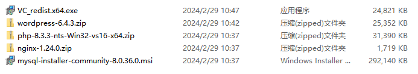

### Microsoft Visual C++ Redistributable Package

> Microsoft Visual C++ Redistributable Package为MySQL依赖的环境

直接同意并安装即可。

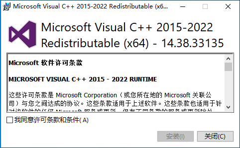

### MySQL

> MySQL数据库为WordPress必须的环境之一，提供数据存放服务

打开安装包，选择`Server only`，后续默认继续即可

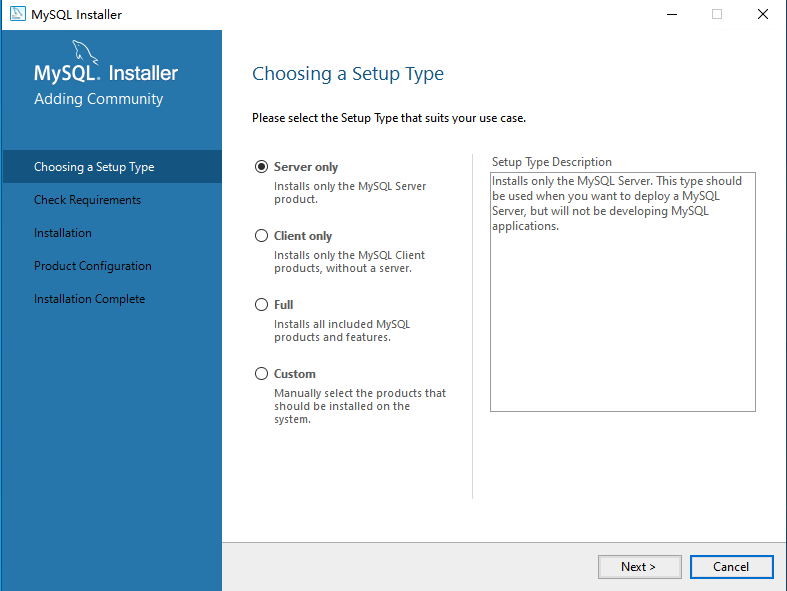

输入的密码为数据库`root`管理用户的密码，<font color=red>请牢记</font>

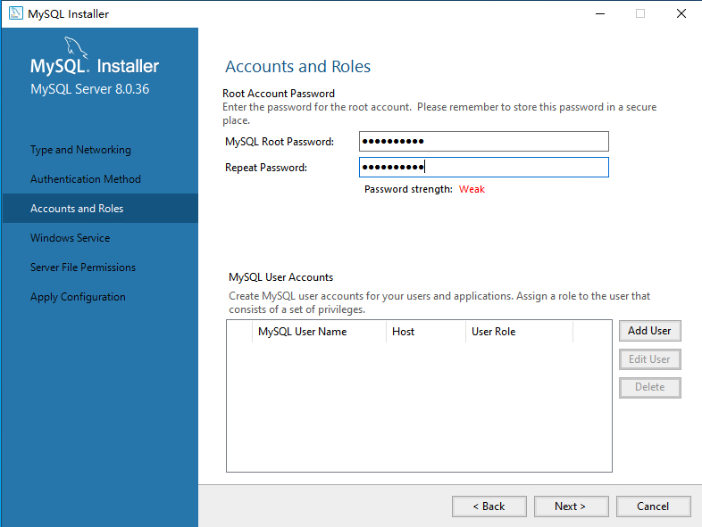

### nginx

> nginx在我们建站的过程中起到作为Web 服务器的用处，负责将网页内容对应至网址端口

直接将下载的安装包解压即可，我解压在`C:\server\nginx`，双击目录的`nginx.exe`即运行程序。

浏览网址[http://127.0.0.1](http://127.0.0.1)，出现以下内容则运行正常

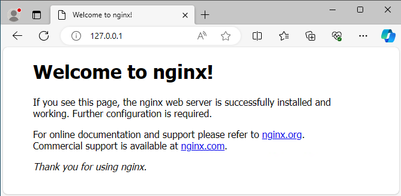

**停止nginx**

`WIN + R`输入`cmd`进入命令行，定位至文件夹（`C:\server\nginx`）并停止应用服务

```bash
cd C:\server\nginx
nginx.exe -s stop
```

### php

> php为WordPress必须的环境之一，php是为Web开发提供的一种简单、高效、灵活的编程语言，类似于html，wordpress就是用php进行编写的

直接解压压缩包至`C:\server\php`，后续进行配置

### WordPress

> *WordPress*本身，提供了基础的创建页面，创建文章功能，可以安装丰富插件

直接解压压缩包至`C:\server\wordpress`

### RunHiddenConsole

> RunHiddenConsole使得命令得以在后台运行，而不会因为终端关闭而停止

直接将压缩包中`x64`中的`RunHiddenConsole.exe`解压放至`C:\server`文件夹

**最终`C:\server`文件夹有以下下内容**（位置只是根据个人偏好选择，任意位置都可以）

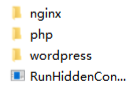

## 配置

<font color=red>注意：下面配置的地址均更改为实际安装位置，如果安装位置和我一样，则直接复制粘贴即可</font>

### 1. MySQL添加数据库

在`开始`菜单中找到`MySQL 8.0 Command Line Client`

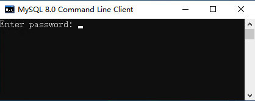

输入刚才的`root`密码并回车，进入MySQL命令行，输入以下命令创建名为`wordpress`的数据库

```mysql
CREATE DATABASE wordpress;
```

### 2. nginx配置

nginx的配置文件是`nginx\conf`里的`nginx.conf`，可以用记事本打开。找到第35行开始的`server`

1. `location /`（第43行）

   `root`: `wordpress`所在位置

   `index`: 添加`index.php`，因为wordpress使用php编写

           location / {
               root   C:/server/wordpress; # 设置为wordpress的位置
               index  index.html index.htm index.php; # 添加index.php
           }

2. `location ~ \.php$`（第65行）

   首先需要将这几行前的`#`删掉以启用php

   `root`: `wordpress`所在位置

   `fastcgi_param`: 直接修改为`$document_root$fastcgi_script_name`

   ```
           location ~ \.php$ {
               root           C:/server/wordpress; # 设置为wordpress的位置
               fastcgi_pass   http://127.0.0.1:9000;
               fastcgi_index  index.php;
               fastcgi_param  SCRIPT_FILENAME  $document_root$fastcgi_script_name;
               include        fastcgi_params;
           }
   ```

以下为修改好的配置，如果前面安装位置和我相同，则可以直接复制替换`server`部分。

```
    server {
        listen       80;
        server_name  localhost;

        #charset koi8-r;

        #access_log  logs/host.access.log  main;

        location / {
            root   C:/server/wordpress; # 设置为wordpress的位置
            index  index.html index.htm index.php; # 添加index.php
        }

        #error_page  404              /404.html;

        # redirect server error pages to the static page /50x.html
        #
        error_page   500 502 503 504  /50x.html;
        location = /50x.html {
            root   html;
        }

        # proxy the PHP scripts to Apache listening on http://127.0.0.1:80
        #
        #location ~ \.php$ {
        #    proxy_pass   http://http://127.0.0.1;
        #}

        # pass the PHP scripts to FastCGI server listening on http://127.0.0.1:9000
        #
        location ~ \.php$ {
            root           C:/server/wordpress; # 设置为wordpress的位置
            fastcgi_pass   http://127.0.0.1:9000;
            fastcgi_index  index.php;
            fastcgi_param  SCRIPT_FILENAME  $document_root$fastcgi_script_name; # 修改为$document_root$fastcgi_script_name;
            include        fastcgi_params;
        }

        # deny access to .htaccess files, if Apache's document root
        # concurs with nginx's one
        #
        #location ~ /\.ht {
        #    deny  all;
        #}
    }
```

### 3. php配置

进入php文件夹，找到`php.ini-development`配置文件并复制为`php.ini`。

1. 搜索`extension_dir`，找到第778行的内容

   ```
   ;extension_dir = "ext"
   ```

   删去最开始的`;`，将`ext`改为php中的真实路径

   ```
   extension_dir = "C:\server\php\ext"
   ```

2. 搜索`cgi.fix_pathinfo`，找到第815行内容

   ```
   ;cgi.fix_pathinfo=1
   ```

   删去`;`

   ```
   cgi.fix_pathinfo=1
   ```

3. 添加扩展`php_mysqli.dll`

   因为配置文件中没有找到该项，于是我们自行添加至任意位置即可，为了方便管理，我放在`extension`项的末尾（第975行）。直接加入以下两行并保存

   ```
   ;mysql extension
   extension=php_mysqli.dll
   ```

### 4. 启动nginx和php

`win + r`输入`cmd`打开命令提示行，分别输入以下两行

```
start C:\server\nginx\nginx.exe
C:\server\php\php-cgi.exe -b http://127.0.0.1:9000 -c C:\server\php\php.ini
```

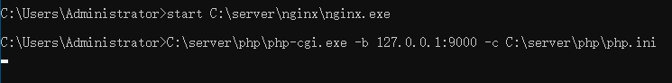

注意：运行第二行之后会卡住不动，不要关闭窗口，保持即可。

接下来在浏览器中访问[http://127.0.0.1](http://127.0.0.1)

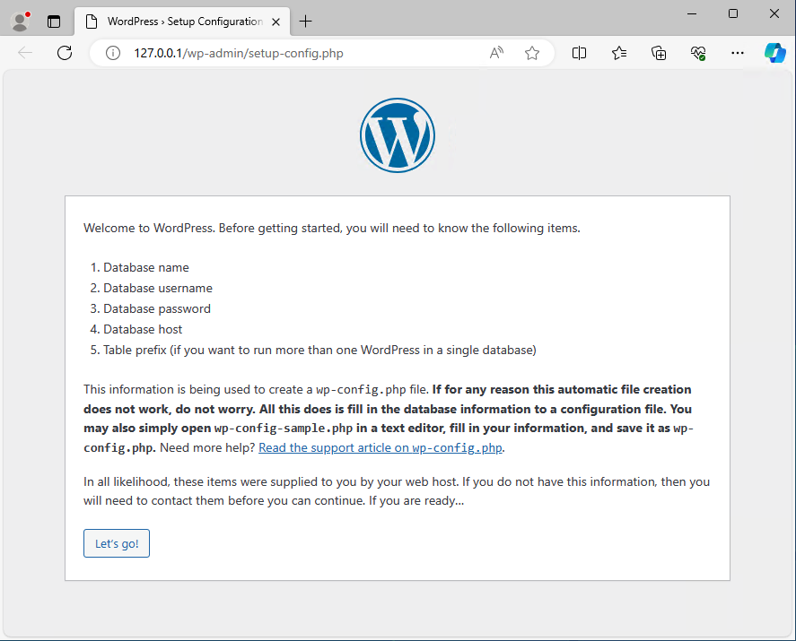

可以发现成功进入wordpress的`setup-config`页面，至此启动成功。

#### 设置批处理文件

刚才的窗口是不能关的，一旦关闭，php-cgi就会关闭，就不能解析php文件。我们可以用批处理来打开/关闭nginx和php-cgi。这里用到RunHiddenConsole(用来隐藏CMD命令窗)，把RunHiddenConsole.exe和批处理文件放在同一级目录，便不需要添加全局环境变量。

1. **start.bat**

```bat
@echo off

set PHP_FCGI_MAX_REQUESTS = 1000

echo Starting PHP FastCGI...

rem 分别为php-cgi.exe和php.ini的路径 ，-b,-c等参数必须保留且注意前后空格

RunHiddenConsole C:\server\php\php-cgi.exe -b http://127.0.0.1:9000 -c C:\server\php\php.ini 

echo Starting nginx...

rem 填写nginx.exe实际位置

RunHiddenConsole C:\server\nginx\nginx.exe

exit
```

2. **stop.bat**

```bat
@echo off
echo Stopping nginx...  
taskkill /F /IM nginx.exe > nul
echo Stopping PHP FastCGI...
taskkill /F /IM php-cgi.exe > nul
exit
```

双击运行`start.bat`和`stop.bat`便可以直接启动/停止nginx和php服务。

### 3. 初始化WordPerss

1. 浏览器访问[http://127.0.0.1](http://127.0.0.1)，进入之前看到的界面，点击`Let's go`

2. 填写选项:

   `Database name`: wordpress（第一步：MySQL添加数据库中填写的数据库名称）

   `Username`: root（管理员帐号，默认）

   `Password`: 数据库用户密码（安装数据库时填写的密码）

   `Database Host`: localhost（保持默认）

   `Table Prefix`: wp_（保持默认）

   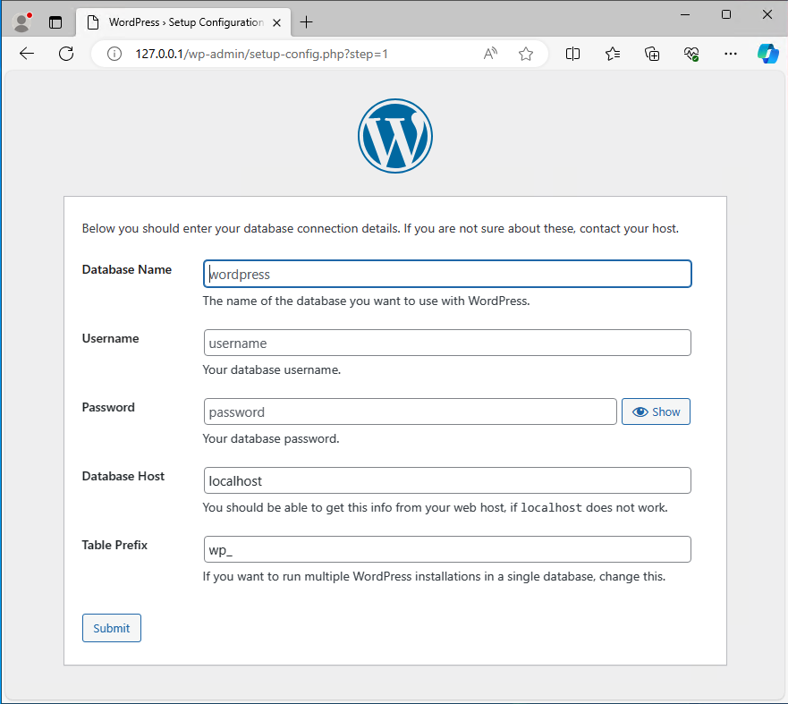

3. 点击`submit`，如果成功，则会出现以下页面，点击`Run the installation`继续安装；如果出现**Error**，说明填写有误，请仔细检查。

   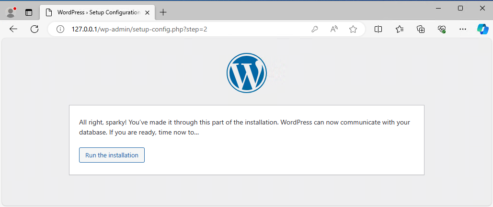

4. 填写信息：

   `Site Title`: 网站标题

   `Username`: 网站管理用户名

   `Password`: 密码<font color=red>（牢记）</font>

   `Your Email`: 你的邮箱

   `Search engine visibility`: 是否被搜索引擎发现（取决于搜索引擎是否遵守）

   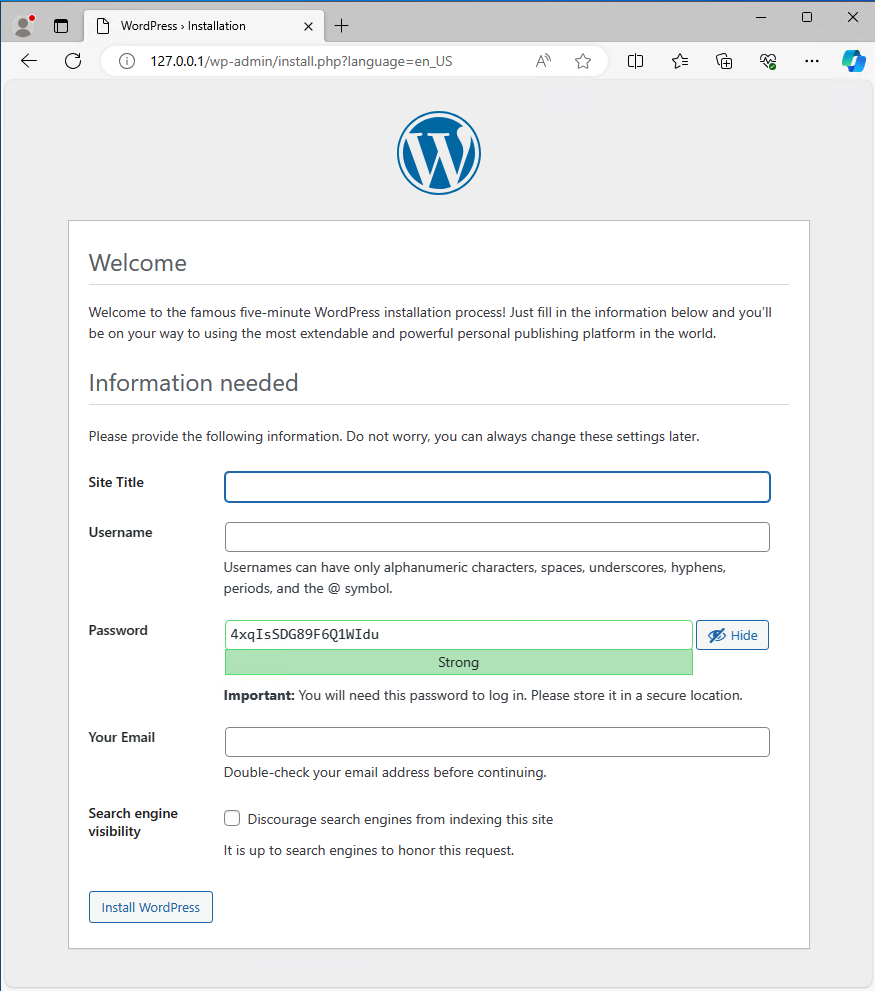

   点击`Install WordPress`进入下一步

5. 出现下面页面，说明网站设置成功。

   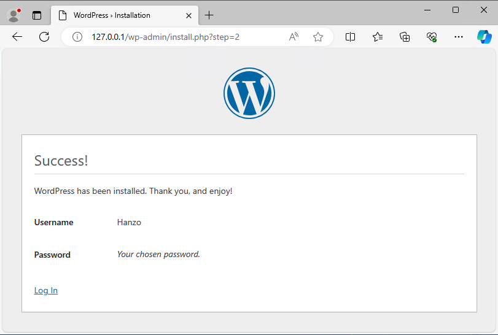
   
6. 访问WordPress主页：[http://127.0.0.1](http://127.0.0.1)

   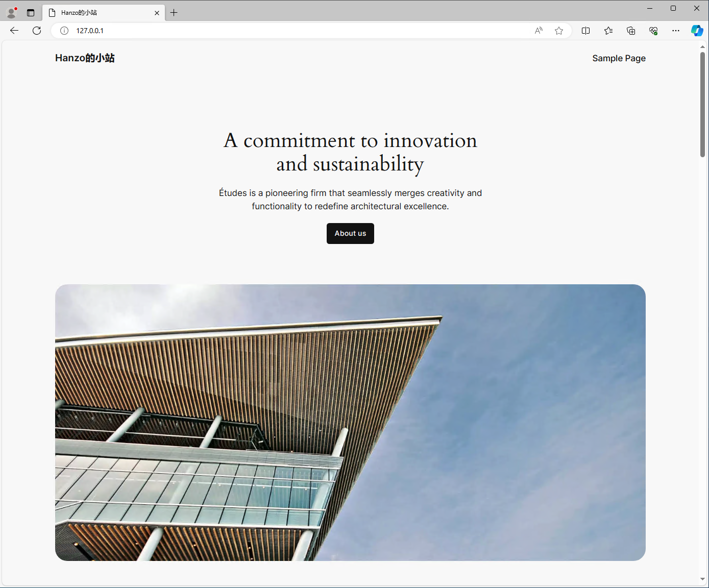

7. 进入WordPress管理界面：[http://127.0.0.1/wp-admin](http://127.0.0.1/wp-admin)

   先填写账号密码进行登录

   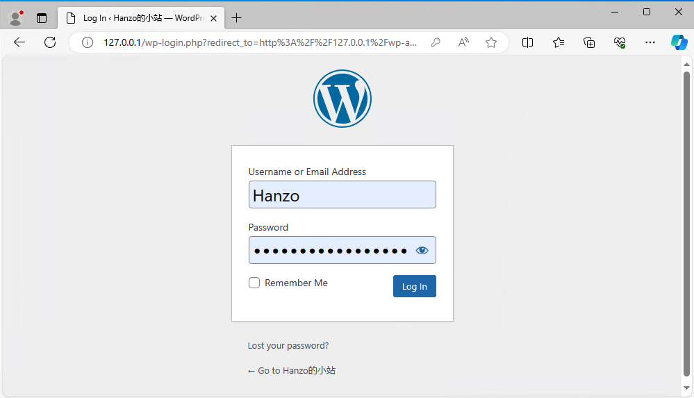

   登录之后进入管理界面

   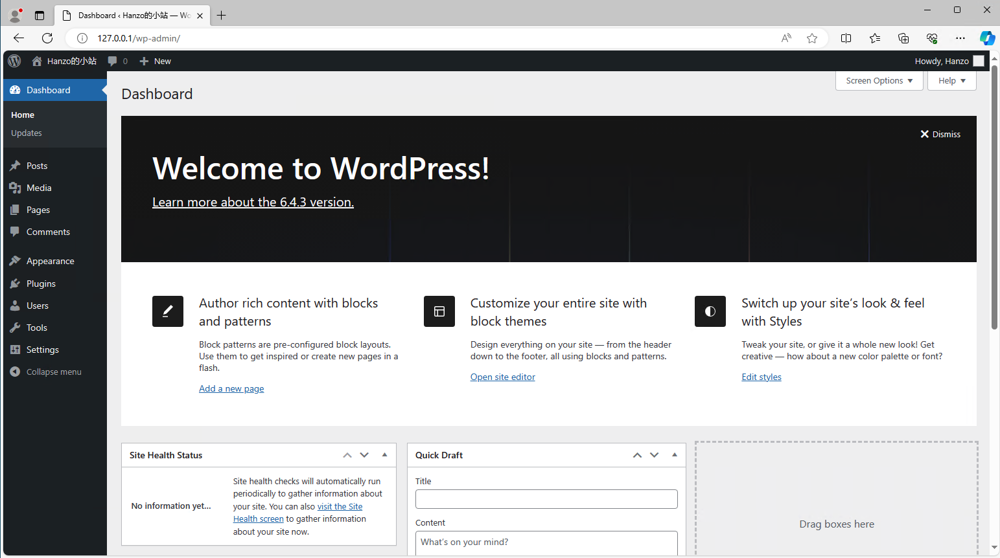

**Reference:**

* [windows下搭建nginx+php开发环境(by 苦逼成长印记)-cnblog](https://www.cnblogs.com/wwjchina/p/9804576.html)

* [如何更改Wordpress语言为中文(by 木鱼在游)-华为开发者联盟](https://huaweicloud.csdn.net/635665e1d3efff3090b5d33a.html?spm=1001.2101.3001.6650.1&utm_medium=distribute.pc_relevant.none-task-blog-2%7Edefault%7ECTRLIST%7Eactivity-1-114964681-blog-117536602.235%5Ev43%5Epc_blog_bottom_relevance_base7&depth_1-utm_source=distribute.pc_relevant.none-task-blog-2%7Edefault%7ECTRLIST%7Eactivity-1-114964681-blog-117536602.235%5Ev43%5Epc_blog_bottom_relevance_base7&utm_relevant_index=2)
