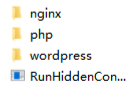

# Windows从零安装WordPress

> 在Linux中，可以用Linux运维工具配合docker很便捷的安装并配置MySQL、nginx、php、WordPress，但是Windows服务器中，我还没有发现类似的面板，就尝试学习用最原始的方法进行安装。

## 准备工作

1. [Microsoft Visual C++ Redistributable Package](https://learn.microsoft.com/en-us/cpp/windows/latest-supported-vc-redist?view=msvc-170)

2. [MySQL](https://dev.mysql.com/downloads/installer/)

3. [nginx](https://nginx.org/en/download.html)

4. [php](https://windows.php.net/download/)

5. [WordPress](https://wordpress.org/download/)

   

### Microsoft Visual C++ Redistributable Package

> Microsoft Visual C++ Redistributable Package为MySQL依赖的环境

直接同意并安装即可。


### MySQL

> MySQL数据库为WordPress必须的环境之一，提供数据存放服务

打开安装包，选择`Server only`，后续默认继续即可


输入的密码为数据库`root`管理用户的密码，<font color=red>请牢记</font>


### nginx

> nginx在我们建站的过程中起到作为Web 服务器的用处，负责将网页内容对应至网址端口

直接将下载的安装包解压即可，我解压在`C:\server\nginx`，双击目录的`nginx.exe`即运行程序。

浏览网址http://127.0.0.1/，出现以下内容则运行正常


**停止nginx**

`WIN + R`输入`cmd`进入命令行，定位至文件夹（`C:\server\nginx`）并停止应用服务

```bash
cd C:\server\nginx
nginx.exe -s stop
```

### php

> php为WordPress必须的环境之一，php是为Web开发提供的一种简单、高效、灵活的编程语言，类似于html，wordpress就是用php进行编写的

直接解压压缩包至`C:\server\php`，后续进行配置

### WordPress

> *WordPress*本身，提供了基础的创建页面，创建文章功能，可以安装丰富插件

直接解压压缩包至`C:\server\wordpress`

**最终`Server`文件夹有一下内容**（位置只是根据个人偏好选择，任意位置都可以）



## 配置

### 1. MySQL添加数据库

`win + R`输入`cmd`打开命令行，
